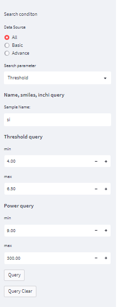
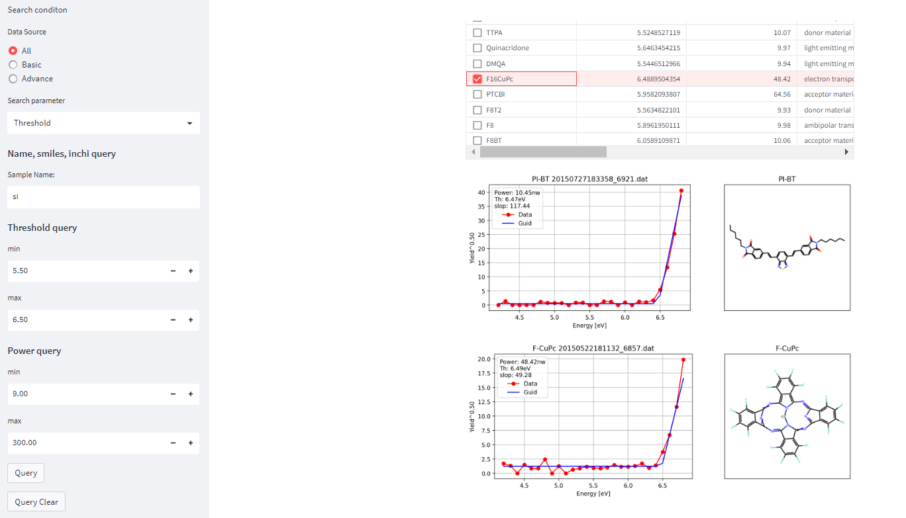

# PYS-DB
PYS Database

https://s-yagyu-pys-db-pysdb-main-1ephtr.streamlit.app/

### Introduction

このデータベースは、NIMSリポジトリ(MDR)に登録されているPYS(光電子収量分光)データ（2次利用が可能なライセンス付与されたもの）を収集し、メタデータの抽出を行いこのリポジトリに構築したものです。
データの利用に関しては、クリエーティブコモンズのCC-BYのライセンスが付与されてるため、原作者の表示を行っていただければ2次利用は可能です。
このデータベースの詳細は、こちらの論文を参照していただければと思います。

検索アプリは、Streamlit cloud（Comunity版）を用いて提供されています。
なお、Webアプリ、データベース、メタデータ作成ツールのソースコードもこのリポジトリに格納されています。
データベースは、各測定シリーズごと（MDRでの登録データ単位）ごとにJSONファイルで情報が抽出されて格納されています。
JSONファイルを直接ダウンロードして編集検索することも可能です。

S. Yagyu et. al: Journal of Surface Analysis. 29 [3] (2023) 146-154.

MDR(Materials Data Repository) https://mdr.nims.go.jp/
 
### 収録データ

収録データは2つに分かれています。

- 基本的な材料データ(Basic)：NIMSの研究者が、基本的材料を選び出し収集したものです。
- 論文材料データ(Advance):論文発表された新規に開発された材料です。

検索に際しては、BasicとAdvanceまたはその両方で検索することができます。

### 注意事項

- 本サービスは、物質・材料科学技術に関する研究開発に資することを目的として提供されるものです。
- 教育又は研究開発目的で本サービスを利用する個人に限り、本サービスを提供致します。
- このデータベースの著作権は、作成者にあります。
- このデータベースの使用により使用者が被ったいかなる損害に対しても、作成者は一切の責任を負いません。
- 公開データに関する著作権その他の権利は、当該公開データに関する権利を現に有する権利者に帰属し、第三者に対して何らの権利も譲渡又は移転されるものではありません。

### 検索アプリの利用方法

https://s-yagyu-pys-db-pysdb-main-1ephtr.streamlit.app/

のURLをクリックすると下記のような画面が現れます。左側に検索条件設定項目があります。
最初はすべてのデータが右側のテーブルに表示されています。

条件を設定して下の方にあるQueryボタンを押してください。
そうすると条件に合ったテーブルが表示されます。
テーブルの左のマークをチェックするとグラフが表示されます。

### DataBase metadata

データベースのメタデータキーは以下の通りです。

#### dat meta

'fileType','deadTime', 'countingTime', 'powerNumber', 'anodeVoltage', 'step',
'model', 'yAxisMaximum', 'startEnergy', 'finishEnergy',
'flagDifDataGroundLevel', 'bgCountingRate', 'measureDate', 'sampleName',
'uvIntensity59', 'targetUv', 'nameLightCorrection', 'sensitivity1',
'sensitivity2', 'uvEnergy', 'countingCorrection', 'photonCorrection',
'pyield', 'npyield', 'nayield', 'guideline', 'countingRate',
 'flGrandLevel', 'flRegLevel', 'uvIntensity', 'thresholdEnergy', 'slope',
 'yslice', 'bg', 'file_name'

Note: キーの内容の詳細は、こちらのリポジトリまたは論文を参照してください。

- S. Yagyu: Journal of Surface Analysis. 29 [2] (2022) 97-110.
- https://github.com/s-yagyu/ACdataConverter

 #### mol metadata

'smiles', 'inchi', 'inchikey'

Note: smiles -> isomeric Smile

 #### excel metadata
'dataLicense', 'datasetTitle', 'dataProvider', 'providerOrganization',
'inputDate', 'aim', 'webReference', 'attachedReference', 'sampleLavel',
'generalName', 'sampleAbbreviation', 'sampleDescription',
'chemicalFormula', 'substrateName', 'sampleShape', 'datFileName',
'molFileName', 'comment'

#### All metadata (json file)
'dataLicense', 'datasetTitle', 'dataProvider', 'providerOrganization',
'inputDate', 'aim', 'webReference', 'attachedReference', 'sampleLavel',
'generalName', 'sampleAbbreviation', 'sampleDescription',
'chemicalFormula', 'substrateName', 'sampleShape', 'datFileName',
'molFileName', 'comment', 'smiles', 'inchi', 'inchikey', 'fileType',
'deadTime', 'countingTime', 'powerNumber', 'anodeVoltage', 'step',
'model', 'yAxisMaximum', 'startEnergy', 'finishEnergy',
'flagDifDataGroundLevel', 'bgCountingRate', 'measureDate', 'sampleName',
'uvIntensity59', 'targetUv', 'nameLightCorrection', 'sensitivity1',
'sensitivity2', 'uvEnergy', 'countingCorrection', 'photonCorrection',
'pyield', 'npyield', 'nayield', 'guideline', 'countingRate',
'flGrandLevel', 'flRegLevel', 'uvIntensity', 'thresholdEnergy', 'slope',
'yslice', 'bg', 'file_name'

---
